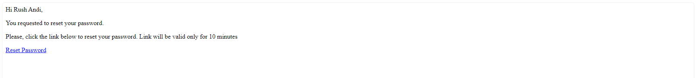
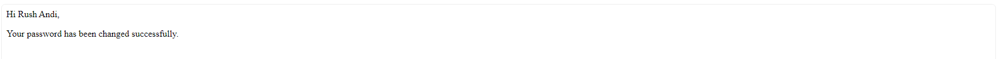

# Movieflicks Backend

Movieflicks is a backend API project developed with Express.js and MongoDB for managing a movie database. Designed with best practices in mind, Movieflicks offers full CRUD functionality for both user and movie management, along with JWT-based authentication for secure access. It supports cloud storage for images via Cloudinary, making it an ideal project for those learning to build and connect with RESTful APIs efficiently.

## Table of Contents

- [Features](#features)
- [Getting Started](#getting-started)
- [Models](#models)
- [API Endpoints](#api-endpoints)
- [Technologies Used](#technologies-used)
- [Screenshots](#screenshots)

## Features

Key features includes:

- ✅ Comprehensive CRUD operations
- ✅ JWT-based authentication
- ✅ Image upload and storage with Cloudinary
- ✅ Advanced movie filtering by name, duration, and genres
- ✅ Pagination for efficient data retrieval
- ✅ User registration with duplicate checks
- ✅ Password encryption using bcrypt
- ✅ Password Recovery: Forgot password and reset password functionality, with secure email notifications
- ✅ Email Notifications via Nodemailer for password reset links and confirmation of successful password reset
- ✅ Mailtrap integration for email functionality testing
- ✅ Environment configuration using dotenv

## Getting Started

**Prerequisites**

- node `^19.2.0`
- npm `^9.2.0`

Make sure you have [npm](https://www.npmjs.com/get-npm) installed globally.
To get started with the project, follow the steps below:

#### 1.Clone the repository:

```bash
$ git clone git@github.com:roshanbist/MovieFlicks.git
$ cd MovieFlicks
```

#### 2.Install dependencies:

```bash
$ npm install
```

#### 3.Set up environment variables

```bash
MONGODB_URL=MongoDB connection URI
PORT=Server port
CLIENT_URL=URL of the client application
CLOUDINARY_CLOUD_NAME=Cloudinary cloud name for image storage
CLOUDINARY_API_KEY=Cloudinary API key
CLOUDINARY_SECRET_KEY=Cloudinary secret key
ACCESS_TOKEN_SECRET_KEY=Secret key for signing access tokens (JWT)
REFRESH_TOKEN_SECRET_KEY=Secret key for signing refresh tokens (JWT)
EMAIL_HOST=SMTP server host for sending emails (e.g., smtp.mailtrap.io)
EMAIL_PORT=SMTP server port (e.g., 2525 for Mailtrap)
EMAIL_USER=SMTP server user credential
EMAIL_PASS=SMTP server password credential
```

#### 4.Run the server:

- In development mode

```bash
$ npm run dev
```

- In production mode

```bash
$ npm run prod
```

The server should now be running at http://localhost:${PORT}.

## Models

There are two models designed in this project.

### Movie Model

| Field              | Type     | Required | Unique | Validation/Constraints                           |
| :----------------- | :------- | :------- | ------ | ------------------------------------------------ |
| name               | String   | Yes      | Yes    | Min 4 characters, Max 50 characters              |
| description        | String   | Yes      | No     | Brief movie description                          |
| releaseYear        | Number   | Yes      | No     | Release year of the movie                        |
| duration           | Number   | Yes      | No     | Duration in minutes                              |
| ratings            | Number   | Yes      | No     | Must be between 1 and 10                         |
| director           | String   | Yes      | No     | Director's name                                  |
| actors             | [String] | Yes      | No     | Array of actor names, cannot be empty            |
| images             | [String] | Yes      | No     | Array of image URLs                              |
| genres             | [String] | Yes      | No     | Array, enum of valid genres: Action, Drama, etc. |
| imagesCloudinaryId | [String] | No       | No     | Cloudinary IDs for images                        |
| createdAt          | Date     | No       | No     | Defaults to current date                         |

### User Model

| Field                        | Type   | Required | Unique | Validation/Constraints                   |
| :--------------------------- | :----- | :------- | ------ | ---------------------------------------- |
| name                         | String | Yes      | No     | Min 2 characters, Max 30 characters      |
| username                     | String | Yes      | Yes    | Min 5 characters, Max 20 characters      |
| email                        | String | Yes      | Yes    | Must be a valid email format             |
| password                     | String | Yes      | No     | Min 6 characters                         |
| confirmPassword              | String | Yes      | No     | Must match password                      |
| avatar                       | String | Yes      | No     | URL for avatar                           |
| role                         | String | No       | No     | Enum: user, admin (default: user)        |
| avatarCloudinaryId           | String | Yes      | No     | Cloudinary ID for avatar                 |
| refreshToken                 | String | No       | No     | For handling JWT refresh                 |
| passwordResetToken           | String | No       | No     | Temporary token for password reset       |
| passwordResetTokenExpireTime | Date   | No       | No     | Expiration time for password reset token |

## API Endpoints

## Auth API

| HTTP METHOD | Endpoint                             | Description                                                                  |
| :---------- | :----------------------------------- | :--------------------------------------------------------------------------- |
| POST        | `/api/v1/auth/register`              | Register a new user.                                                         |
| POST        | `/api/v1/auth/login`                 | Login in user and return access, refresh token.                              |
| POST        | `/api/v1/auth/refresh`               | Renew access token using valid refresh token.                                |
| POST        | `/api/v1/auth/forgot-password`       | Initiate password reset process by sending a reset link to the user's email. |
| POST        | `/api/v1/auth/reset-passowrd/:token` | Reset user's password using the token sent in the reset link.                |
| POST        | `/api/v1/auth/logout`                | Logout the user from the application clearing the authentication cookie.     |

## User API

| HTTP METHOD | Endpoint                        | Description                                                           |
| :---------- | :------------------------------ | :-------------------------------------------------------------------- |
| GET         | `/api/v1/users`                 | Retrieve the details of all users.                                    |
| GET         | `/api/v1/users/:id`             | Retrieve detailed information of a single user by their ID.           |
| POST        | `/api/v1/users/change-password` | Change the logged-in user's password.                                 |
| PUT         | `/api/v1/users/:id`             | Update user information (only allowed for the logged-in user).        |
| DELETE      | `/api/v1/users/:id`             | Delete a user (admin access required, users can't delete themselves). |

## Movie API

| HTTP METHOD | Endpoint                                | Description                                                                         |
| :---------- | :-------------------------------------- | :---------------------------------------------------------------------------------- |
| GET         | `/api/v1/movies`                        | Retrieve a list of all movies.                                                      |
| GET         | `/api/v1/movies/:id`                    | Retrieve detailed information of a single movie by its ID.                          |
| GET         | `/api/v1/movies?page=1&limit=10`        | Retrieve a paginated list of movies, with the specified page and limit.             |
| GET         | `/api/v1/movies?sort=duration,-ratings` | Retrieve a list of movies, sorted by duration (ascending) and ratings (descending). |
| POST        | `/api/v1/movies`                        | Add a new movie to the database. (user logged in required).                         |
| PUT         | `/api/v1/movies/:id`                    | Update the details of an existing movie by its ID. (user logged in required).       |
| DELETE      | `/api/v1/movies/:id`                    | Delete a movie from the database by its ID (admin access required).                 |

## Filter Movie API

| HTTP METHOD | Endpoint                                                                               | Description                                                       |
| :---------- | :------------------------------------------------------------------------------------- | :---------------------------------------------------------------- |
| GET         | `/api/v1/movies?name=inception`                                                        | Filter movies by name.                                            |
| GET         | `/api/v1/movies?genres=Action,Thriller`                                                | Filter movies by genres.                                          |
| GET         | `/api/v1/movies?min_duration=140&max_duration=190`                                     | Filter movies by duration range.                                  |
| GET         | `/api/v1/moviesname=the&min_duration=135&genres=Action&sort=-duration&page=1&limit=10` | Filter and sort movies list by joining multiple query parameters. |

## Technologies Used

- **Node.js** - Backend runtime environment
- **Express** - Web framework for building APIs
- **MongoDB** - NoSQL database
- **JWT**- Authentication tokens
- **bcrypt** - Password hashing
- **Multer** - Middleware for file uploads
- **Cloudinary** - Image storage
- **Utilities** - dotenv for environment variables, validator for data validation
- **Nodemailer** - Used for sending emails like password resets and notifications
- **Mailtrap** - Email testing tool to catch and preview emails in a safe environment

## Screenshots

Screenshots of Email Testing for Password Reset

- Screenshots of Email Testing for Password Reset:
  

-Password Reset Successfully:

